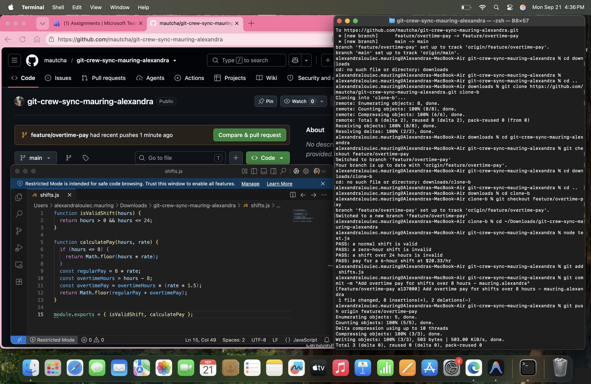
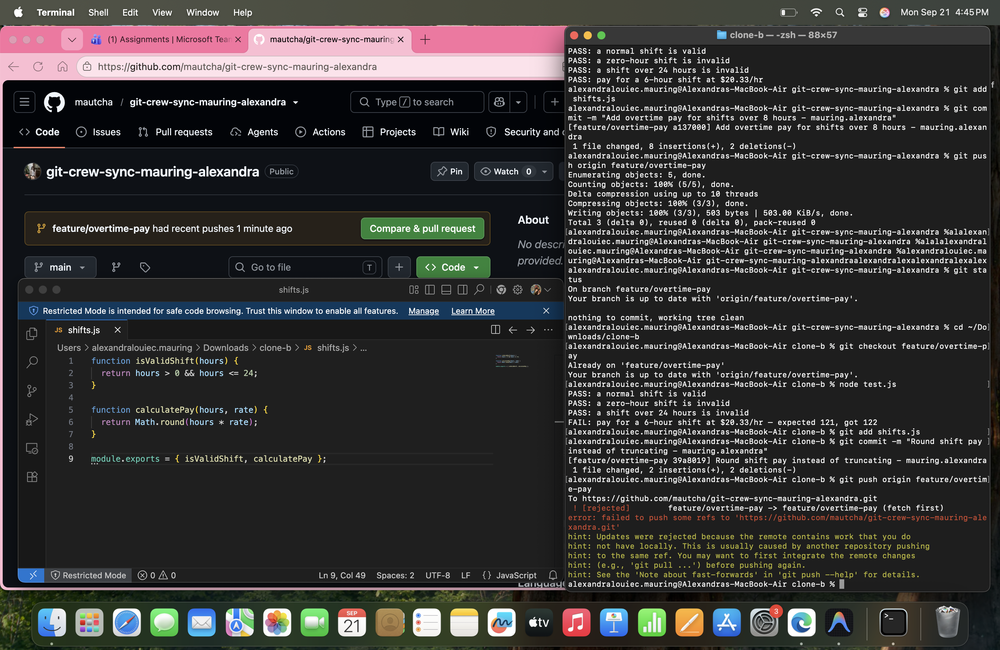
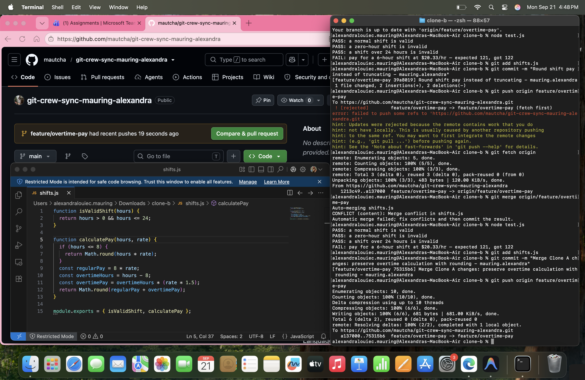
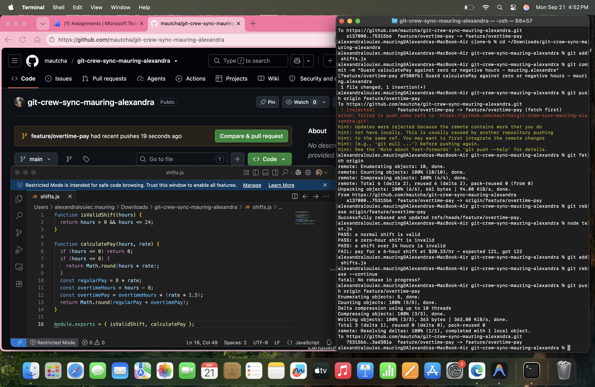
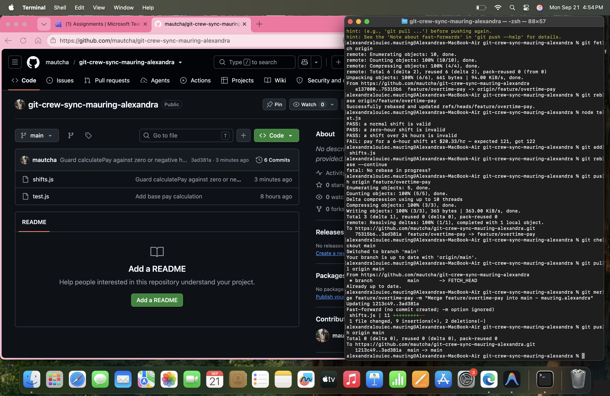
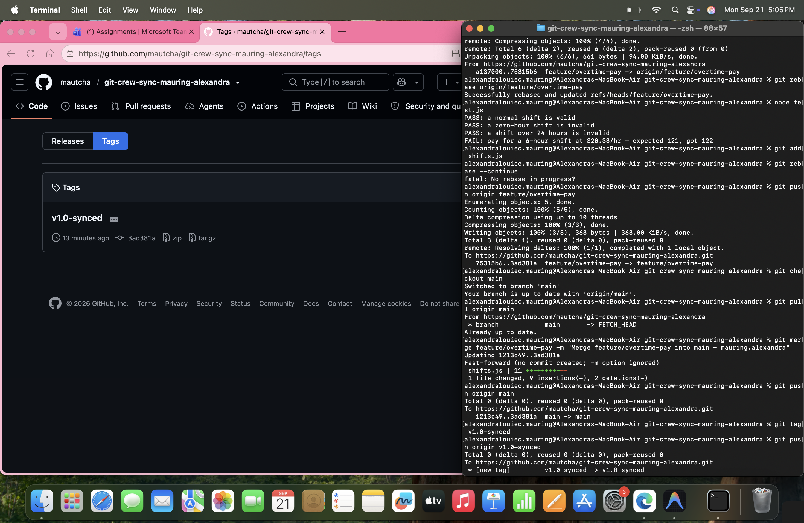

# Workflow Synchronization Report

## Task 1: Overtime Pay Push (Clone A)
Implemented overtime pay for hours beyond 8 (at 1.5x) in shifts.js and pushed from Clone A.

---

## Task 2: Divergence and Push Rejection (Clone B)
Modified shifts.js to round shift pay instead of truncating without fetching upstream updates, resulting in a rejected non-fast-forward push.

---

## Task 3: Merge Reconciliation (Clone B)
Fetched remote changes and reconciled differences using git merge origin/feature/overtime-pay. Resolved conflicts to retain both rounding and overtime logic, then pushed the merge commit.

---

## Task 4: Divergence and Rebase Reconciliation (Clone A)
Added zero/negative hour guards to Clone A, resulting in another rejected push. Resolved via git fetch and git rebase origin/feature/overtime-pay, resolving conflicts without requiring a force-push.

---

## Task 5: Merge into Main (Clone A)
Merged the completed feature/overtime-pay branch into main and pushed the updated branch upstream.

---

## Task 6: Tag Release
Tagged the consolidated commit as v1.0-synced and pushed all tags upstream.

---

## Lab Questions

### 1. What did the rejected push error message tell you, and why did it happen?
The error message (! [rejected] ... Updates were rejected because the remote contains work that you do not have locally) indicated that the local branch was behind the remote tracking branch. It occurred because commits were pushed to the remote repository from a different clone, preventing a fast-forward update to safeguard against overwriting remote history.

### 2. What's the actual difference between how you resolved Task 3 (merge) vs Task 4 (rebase)?
- Task 3 (Merge): Combined the divergent branch tips by generating a new merge commit with two parents. The existing commit history and SHAs remained intact, explicitly logging the point of divergence and combination.
- Task 4 (Rebase): Temporarily shelved local commits, fast-forwarded the local base to match the remote branch tip, and reapplied the local commits sequentially on top. This created a linear history with new commit hashes, avoiding a merge commit.

### 3. What one habit would have avoided both rejected pushes in this lab?
Running git pull --rebase (or git fetch to inspect upstream changes) prior to making new commits and directly before pushing.

### 4. Which approach — merge or rebase — would you default to on a shared team branch, and why?
Default to merge on shared team branches. Rebase rewrites commit history and generates new SHAs; if other team members have pulled those commits, rebasing causes synchronization issues and conflicting trees. Merging preserves the shared history and records when divergent work was brought together.
